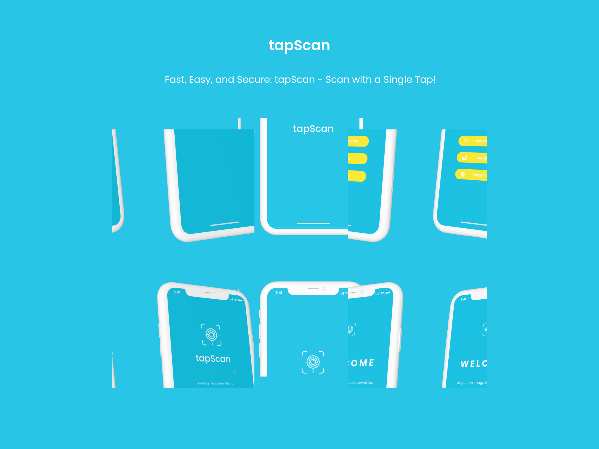

<h1 align="center">
  tapScan
</h1>

Fast, Easy, and Secure: tapScan - Scan with a Single Tap!

## About

tapScan stands for I2T (Image-to-Text) OCR (Optical Character Recognition). tapScan is an application that lets you convert text image into an editable and searchable text.

## Group 6

- [Wildan Hafidz Mauludin](https://github.com/nikoshaa)
- [Dhayu Intan Nareswari](https://github.com/DhayuIntan)
- [Farhan Dwi Pramana](https://github.com/FarhanDwiPramana)
- [Mochammad Zaky Zamroni](https://github.com/zakyzuf)
- [Ziedny Bisma Mubarok](https://github.com/Ziedny28)

# Screen dan PIC

| No. | Nama Screen | Fitur | PIC   |
| --- | ----------- | ----- | ----- |
| 1   | Splash      | -     | Mr. X |

## Link Figma

[Figma - Group 6](https://www.figma.com/proto/HCrU4zhq04mPjdhW0XChLU/tapScan?page-id=1%3A177&type=design&node-id=61-988&viewport=-518%2C-859%2C0.25&t=tijReJkfkQDKTMXg-1&scaling=scale-down&starting-point-node-id=61%3A988&mode=design)

## Fitur Unggulan

## Credits

[Fonts Poppins](https://fonts.google.com/specimen/Poppins)
